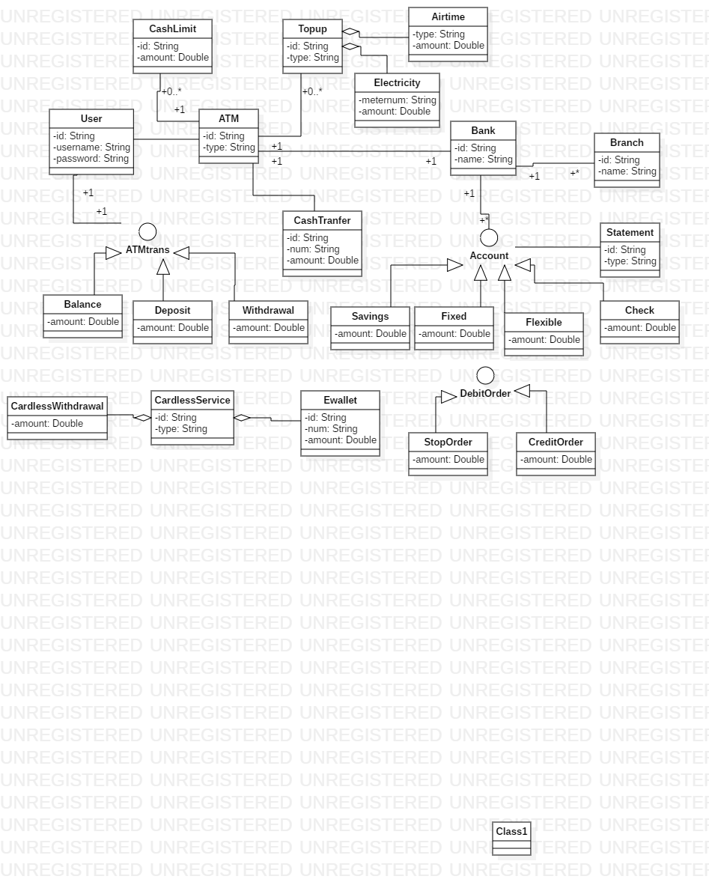

 <h4>Domain problem: ATM</h4>
 The atm transaction should keep the system simple since there’s fraud out there so my 
  solution is that if we can keep simpler that it expected but, in the meantime, 
  hide personal information. By not using any kind of card anymore now just do 
  profile in the bank branch then go login into atm, do run your transactions 
  without having card just your profile and the machine should not contain
   a port for cards just a plain machine with buttons or even touch screen 
   to access your transaction only. It will decrease the scam and fraud in banks. After your 
   logins the transactions should show up/ show menu to select your option.

<h5>Sub-domain: ATM- transaction</h5> that will allow user to choose from the functions which are withdraw, 
 deposit and balance without entering or inserting any card.
  This domain will contain those four functions in the atm transaction. 
  It will tell you your balance and how much you want to withdraw and if the 
  funds are insufficient will give you note, but firstly you will have to create logins to access your funds.

  

=======

